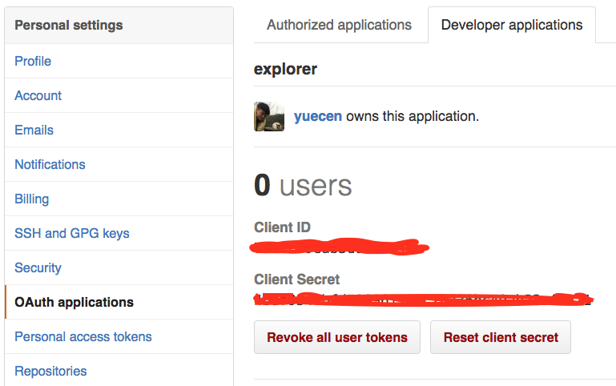
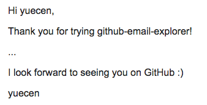

## github-email-explorer

[](https://travis-ci.org/yuecen/github-email-explorer)

For people who want to create a email marketing plain for particular group on 
GitHub, github-email-explorer can send email to the group you want.

There are two main abilities, exploring email and sending email, in 
github-email-explorer that the concreted commends are ```ge-explore``` and ```ge-sendgrid```. 
SendGrid is only one email provider in current progress.

#### Installation

```bash
pip install github-email-explorer
```

#### Example of Getting Email List of Stargazers

##### Using Command
You can get user email by ```ge-explore``` with <user_account>/<repo_name>. For example, 

```bash
$ ge-explore --repo yuecen/github-email-explorer

// The email list will be responded in a formatted string, 
John <John@example.org>; Peter James <James@example.org>;

// You can copy contact list to any email service you have, 
// then send your email with those contact address.
```

If you encounter the situation of limitation from GitHub server during running 
the command, please add ```--client_id <your_github_auth_id> --client_secret <your_github_auth_secret>``` with the command above.

You can apply and get client ID and secret from this page.



##### Using Python Script

```python
from github_email_explorer import github_email

# github_api_auth = ('<your_client_id>', '<your_client_secret>')
# ges = github_email.stargazers_emails('yuecen', 'github-email-explorer', github_api_auth=github_api_auth)

ges = github_email.stargazers_emails('yuecen', 'github-email-explorer')

for ge in ges:
    print ge.name, ge.email
```

You can find get_email.py file in examples folder, and run it like following.

```bash
$ python examples/get_email.py

// example output
John <John@example.org>; Peter James <James@example.org>;
```

#### How to Send a Email to GitHub Users from a Particular Repository?

##### 1. Write Email Content with Template Format

The [Jinja2] is used to render email content in github-email-explorer, the basic 
[expressions] make you email more flexible for sending to people who have 
individual email address.

Here is an example to use following syntax, the file saved to ```examples/marketing_email.txt```

```
<p>Hi {{ to_name }},</p>
<p>Thank you for trying github-email-explorer!</p>

<p>...</p>

<p>I look forward to seeing you on GitHub :)</p>
<p>yuecen</p>
```

```{{ to_name }}``` is the syntax to assign value in runtime stage for client name.

##### 2. Send Email

In order to send email for many users flexibly, we combine the email list from 
result of ge-explore and SendGrid.

```
ge-sendgrid --api_user <your_sendgrid_api_user_name> 
            --api_key <your_sendgrid_api_key> 
            --explore_starred <user_account>/<repo_name>
            --template_path <github-email-explorer_folder_path>/examples/marketing_email.txt
            --from_email test@example.com
```

The following image is an real example of email format for ge-sendgrid command.

> 

#### Example of Getting API Status

In order to know API [rate limit] you are using, the status information can be 
found from github-email-explorer command.

Without authentication

```bash
$ ge-explore --status

Resource Type      Limit    Remaining  Reset Time
---------------  -------  -----------  --------------------
Core                  60           60  2016-07-07T04:56:12Z
Search                10           10  2016-07-07T03:57:12Z
```

With authentication

You can request more than 60 using authentication by [OAuth applications]

```bash
$ ge-explore --status --client_id <your_github_auth_id> --client_secret <your_github_auth_secret>

== GitHub API Status ==
Resource Type      Limit    Remaining  Reset Time
---------------  -------  -----------  --------------------
Core                5000         5000  2016-07-06T07:59:47Z
Search                30           30  2016-07-06T07:00:47Z
```

[rate limit]:https://developer.github.com/v3/rate_limit/
[OAuth applications]:https://github.com/settings/developers
[Jinja2]:http://jinja.pocoo.org/
[expressions]:http://jinja.pocoo.org/docs/dev/templates/#expressions